# Backend Flowchart - Mermaid Diagram

```mermaid
flowchart TB
    Start([Client Request]) --> Auth{Authentication<br/>Bearer Token?}
    Auth -->|Valid/Not Required| Route{API Endpoint}
    Auth -->|Invalid| Error1[Return 401 Unauthorized]
    
    Route -->|/api/transcripts/process| UploadFlow[File Upload Flow]
    Route -->|/api/process-teams-url| TeamsURLFlow[Teams URL Flow]
    Route -->|/api/transcripts/process-sharepoint-url| SharePointFlow[SharePoint Flow]
    Route -->|/api/summaries/*| SummaryFlow[Summary Retrieval]
    Route -->|/api/action-items/*| ActionItemFlow[Action Items]
    Route -->|/api/projects/*| ProjectFlow[Projects]
    
    %% File Upload Flow
    UploadFlow --> ValidateFile[Validate File<br/>- File type<br/>- File size<br/>- Security checks]
    ValidateFile -->|Invalid| Error2[Return 400 Bad Request]
    ValidateFile -->|Valid| SaveTemp[Save to Temp File]
    SaveTemp --> CheckDuplicate{Check Duplicate<br/>File Hash?}
    CheckDuplicate -->|Duplicate| ConfirmOld{Old Meeting?<br/>Requires Confirmation}
    CheckDuplicate -->|New| ProcessFile[Process File]
    ConfirmOld -->|Yes| ReturnConfirm[Return Confirmation Request]
    ConfirmOld -->|No| ProcessFile
    
    %% Teams URL Flow
    TeamsURLFlow --> ValidateURL[Validate Teams URL<br/>- Teams only<br/>- Format check]
    ValidateURL -->|Invalid| Error3[Return 400 Bad Request]
    ValidateURL -->|Valid| ExtractMeetingID[Extract Meeting ID<br/>from URL]
    ExtractMeetingID --> GetMeetingDetails[Get Meeting Details<br/>via Graph API]
    GetMeetingDetails --> SearchRecordings[Search Recordings<br/>in SharePoint]
    SearchRecordings -->|Multiple Found| ShowSelection[Return Recordings List<br/>Requires Selection]
    SearchRecordings -->|Single/Selected| DownloadFiles[Download Files]
    
    %% SharePoint Flow
    SharePointFlow --> ValidateURL2[Validate Teams URL]
    ValidateURL2 --> ExtractIDs[Extract Meeting & User IDs]
    ExtractIDs --> SearchSharePoint[Search SharePoint<br/>for Recordings/Transcripts]
    SearchSharePoint --> FilterFiles[Filter by Selection<br/>if provided]
    FilterFiles --> DownloadFiles
    
    %% Download and Process
    DownloadFiles --> ValidateSize{File Size<br/>Valid?}
    ValidateSize -->|Too Large| Error4[Return 400<br/>File Too Large]
    ValidateSize -->|Valid| ProcessFile
    
    %% Core Processing Pipeline
    ProcessFile --> DetectType{File Type?}
    DetectType -->|Audio/Video| Transcribe[Transcribe Audio<br/>Whisper Model]
    DetectType -->|Text| ReadText[Read Text File]
    Transcribe --> GetTranscript[Get Transcript Text]
    ReadText --> GetTranscript
    
    GetTranscript --> GenerateSummary[Generate Summary<br/>via LLM]
    GenerateSummary --> ExtractEntities[Extract Entities<br/>- Action Items<br/>- Decisions<br/>- Risks<br/>- Participants]
    
    ExtractEntities --> StoreDB[(Store in SQLite<br/>Database)]
    StoreDB --> CheckEmpty{Empty<br/>Meeting?}
    CheckEmpty -->|Yes| MarkEmpty[Mark as Empty<br/>in Metadata]
    CheckEmpty -->|No| SyncIntegrations[Sync to Integrations]
    
    %% Integration Sync
    SyncIntegrations --> SyncTrello{Trello<br/>Sync?}
    SyncTrello -->|Yes| CreateBoard[Create/Get Trello Board]
    CreateBoard --> CreateLists[Create Lists<br/>To Do, Doing, Done]
    CreateLists --> CreateCards[Create Action Item Cards]
    CreateCards --> AssignCards[Assign to Owners]
    AssignCards --> SendAssignmentReminder{Assignment<br/>Reminder?}
    SendAssignmentReminder -->|Yes| ReminderFlow[Send Reminder]
    
    SyncTrello -->|No/Skip| SyncConfluence{Confluence<br/>Sync?}
    SyncConfluence -->|Yes| CreatePage[Create Confluence Page]
    CreatePage --> FormatContent[Format Summary Content<br/>- Title<br/>- Summary<br/>- Action Items<br/>- Decisions<br/>- Risks]
    FormatContent --> StorePage[Store Page URL<br/>in Metadata]
    
    SyncConfluence -->|No/Skip| MultiMeeting{Multi-Meeting<br/>Analysis?}
    MultiMeeting -->|Yes| AnalyzeProject[Analyze Project<br/>Across Meetings]
    MultiMeeting -->|No| ReturnResponse[Return Response]
    AnalyzeProject --> ReturnResponse
    
    %% Summary Retrieval Flow
    SummaryFlow --> GetSummary[Get Summary from DB]
    GetSummary -->|Found| ReturnSummary[Return Summary Data]
    GetSummary -->|Not Found| Error5[Return 404]
    
    %% Action Items Flow
    ActionItemFlow --> FilterAI{Filter<br/>Parameters?}
    FilterAI -->|Owner| FilterByOwner[Filter by Owner]
    FilterAI -->|Status| FilterByStatus[Filter by Status]
    FilterAI -->|Project| FilterByProject[Filter by Project]
    FilterByOwner --> GetAIs[Get Action Items from DB]
    FilterByStatus --> GetAIs
    FilterByProject --> GetAIs
    GetAIs --> ReturnAIs[Return Action Items]
    
    %% Project Flow
    ProjectFlow --> ProjectOp{Operation?}
    ProjectOp -->|GET| ListProjects[List All Projects<br/>from DB]
    ProjectOp -->|POST| CreateProject[Create New Project]
    ProjectOp -->|DELETE| DeleteProject[Delete Project<br/>- Archive Trello<br/>- Delete Confluence<br/>- Clean DB]
    ProjectOp -->|Extract Emails| ExtractEmails[Extract Emails<br/>from Meetings]
    ListProjects --> ReturnProjects[Return Projects]
    CreateProject --> ReturnProjects
    DeleteProject --> ReturnProjects
    ExtractEmails --> ReturnProjects
    
    %% Reminder System Flow
    ReminderFlow --> CheckReminders[Check Pending Reminders<br/>12-24 hours before deadline]
    CheckReminders --> GetItems[Get Action Items<br/>from DB]
    GetItems --> SyncDeadlines[Sync Deadlines<br/>from Trello]
    SyncDeadlines --> FilterPending[Filter Pending<br/>12-24h window]
    FilterPending --> SendReminder{Send<br/>Reminder}
    
    SendReminder --> TrySMTP{SMTP<br/>Configured?}
    TrySMTP -->|Yes| SendEmailSMTP[Send Email via SMTP]
    TrySMTP -->|No| TryGraph{Graph API<br/>Configured?}
    TryGraph -->|Yes| GetToken[Get Access Token<br/>via Refresh Token]
    GetToken --> SendEmailGraph[Send Email via<br/>Graph API /me/sendMail]
    TryGraph -->|No| TryTrello{Trello<br/>Card Exists?}
    TryTrello -->|Yes| AddComment[Add Trello Comment]
    TryTrello -->|No| SkipReminder[Skip Reminder]
    
    SendEmailSMTP -->|Success| ReminderSent[Reminder Sent]
    SendEmailSMTP -->|Fail| TryGraph
    SendEmailGraph -->|Success| ReminderSent
    SendEmailGraph -->|Fail| TryTrello
    AddComment --> ReminderSent
    SkipReminder --> ReminderSent
    
    %% Assignment Reminder Flow
    SendAssignmentReminder -->|New Task| CheckEmail{Owner Email<br/>Found?}
    CheckEmail -->|Yes| SendAssignmentEmail[Send Assignment Email<br/>via SMTP/Graph API]
    CheckEmail -->|No| AddTrelloComment[Add Trello Comment]
    SendAssignmentEmail --> AssignmentSent[Assignment Reminder Sent]
    AddTrelloComment --> AssignmentSent
    
    %% Return Response
    ReturnResponse --> FormatResponse[Format Response<br/>- Summary ID<br/>- Process ID<br/>- Status]
    FormatResponse --> UpdateProgress[Update Progress<br/>Tracking]
    UpdateProgress --> End([Return Response to Client])
    
    ReturnSummary --> End
    ReturnAIs --> End
    ReturnProjects --> End
    ReminderSent --> End
    AssignmentSent --> End
    
    %% Error Handling
    Error1 --> End
    Error2 --> End
    Error3 --> End
    Error4 --> End
    Error5 --> End
    
    %% Styling
    classDef startEnd fill:#90EE90,stroke:#333,stroke-width:2px
    classDef process fill:#87CEEB,stroke:#333,stroke-width:2px
    classDef decision fill:#FFD700,stroke:#333,stroke-width:2px
    classDef database fill:#FF6347,stroke:#333,stroke-width:2px
    classDef integration fill:#9370DB,stroke:#333,stroke-width:2px
    classDef error fill:#FF6B6B,stroke:#333,stroke-width:2px
    
    class Start,End startEnd
    class ProcessFile,Transcribe,GenerateSummary,ExtractEntities,CreatePage,FormatContent process
    class Auth,Route,CheckDuplicate,ConfirmOld,DetectType,CheckEmpty,SyncTrello,SyncConfluence,MultiMeeting,FilterAI,ProjectOp,TrySMTP,TryGraph,TryTrello,CheckEmail decision
    class StoreDB,GetSummary,GetAIs,GetItems database
    class CreateBoard,CreateCards,CreatePage,SendEmailSMTP,SendEmailGraph,AddComment integration
    class Error1,Error2,Error3,Error4,Error5 error
```



## Backend Architecture Overview

### Main Components

1. **API Layer** (`backend/api/`)
   - `transcripts.py` - File upload and processing endpoints
   - `summaries.py` - Summary retrieval endpoints
   - `action_items.py` - Action item management endpoints
   - `projects.py` - Project management endpoints

2. **Core Processing** (`backend/meeting_summarizer/core/`)
   - `transcript_processor.py` - Audio/video transcription
   - `summarizer.py` - LLM-based summary generation
   - `storage.py` - SQLite database operations

3. **Integrations** (`backend/meeting_summarizer/integrations/`)
   - `action_item_manager.py` - Trello integration & reminders
   - `knowledge_base.py` - Confluence integration
   - `teams_integration.py` - Microsoft Teams API
   - `sharepoint_download.py` - SharePoint file downloads

4. **Security** (`backend/security.py`)
   - Bearer token authentication
   - File validation
   - Input sanitization

### Key Flows

#### 1. File Upload Flow
- File validation (type, size, security)
- Duplicate detection via file hash
- Transcription (if audio/video)
- Summary generation via LLM
- Entity extraction (action items, decisions, risks)
- Database storage
- Integration sync (Trello, Confluence)

#### 2. Teams URL Flow
- URL validation (Teams only)
- Meeting ID extraction
- Graph API meeting details
- SharePoint recording search
- File download and processing

#### 3. Reminder System Flow
- Check pending reminders (12-24h window)
- Sync deadlines from Trello
- Send reminders via:
  - SMTP (priority 1)
  - Graph API (priority 2)
  - Trello comments (fallback)

#### 4. Integration Sync Flow
- Trello: Create board → Lists → Cards → Assignments
- Confluence: Create page → Format content → Store URL
- Multi-meeting analysis (optional)

### Database Schema

- **meetings** - Meeting summaries
- **action_items** - Action items with deadlines
- **projects** - Project metadata
- **processed_files** - File hash tracking
- **email_mappings** - Owner email mappings

### Authentication Flow

- Bearer token validation (if configured)
- Public endpoints: File upload, processing
- Protected endpoints: Summaries, action items, projects

## 📊 System Architecture Overview

### Layer Breakdown

```
┌─────────────────────────────────────────────────────────────┐
│                    1. USER INTERACTION LAYER                 │
│  - Web Frontend (HTML/CSS/JavaScript)                       │
│  - API Clients (curl, Postman, Python requests)             │
│  - CLI Scripts (command line interface)                     │
└────────────────────────┬────────────────────────────────────┘
                         │
┌────────────────────────▼────────────────────────────────────┐
│                    2. API ROUTING LAYER                      │
│  - FastAPI Application (backend/main.py)                    │
│  - Authentication Middleware                                 │
│  - CORS & Security Headers                                  │
│  - API Endpoints (backend/api/)                             │
└────────────────────────┬────────────────────────────────────┘
                         │
┌────────────────────────▼────────────────────────────────────┐
│                    3. VALIDATION LAYER                       │
│  - Input Sanitization (security.py)                         │
│  - File Validation                                          │
│  - URL Validation (Teams Only!)                             │
│  - Duplicate Detection                                      │
└────────────────────────┬────────────────────────────────────┘
                         │
┌────────────────────────▼────────────────────────────────────┐
│                    4. PROCESSING LAYER                       │
│  - File Type Detection                                      │
│  - Transcription (Whisper Model)                            │
│  - Text Parsing                                             │
│  - Metadata Extraction                                      │
└────────────────────────┬────────────────────────────────────┘
                         │
┌────────────────────────▼────────────────────────────────────┐
│                    5. AI PROCESSING LAYER                    │
│  - Prompt Engineering                                       │
│  - OpenAI API Calls (GPT-3.5/GPT-4)                        │
│  - Response Parsing                                         │
│  - Entity Extraction (Action Items, Decisions, Risks)      │
│  - Post-Processing & Validation                             │
└────────────────────────┬────────────────────────────────────┘
                         │
┌────────────────────────▼────────────────────────────────────┐
│                    6. DATA STORAGE LAYER                     │
│  - SQLite Database (meetings, action_items, projects)       │
│  - File System (JSON files, original files)                 │
│  - Hash Tracking (processed_files)                          │
└────────────────────────┬────────────────────────────────────┘
                         │
┌────────────────────────▼────────────────────────────────────┐
│                    7. INTEGRATION LAYER                      │
│  - Trello Sync (Board creation, Card management)            │
│  - Confluence Sync (Page creation, HTML formatting)         │
│  - SharePoint Access (File downloads)                       │
│  - Microsoft Graph API (Meeting details, Email)             │
└────────────────────────┬────────────────────────────────────┘
                         │
┌────────────────────────▼────────────────────────────────────┐
│                    8. RESPONSE LAYER                         │
│  - Format JSON Response                                     │
│  - Include External URLs                                    │
│  - Return to Client                                         │
└─────────────────────────────────────────────────────────────┘

┌─────────────────────────────────────────────────────────────┐
│                 9. BACKGROUND PROCESSES LAYER                │
│  - Scheduler (APScheduler)                                  │
│  - Reminder System (Hourly checks)                          │
│  - Email Notifications (SMTP/Graph API)                     │
│  - Overdue Task Detection                                   │
└─────────────────────────────────────────────────────────────┘
```

---

## 🔄 Data Flow Diagram

```
[USER] → [FRONTEND] → [API] → [VALIDATION]
                                    ↓
                              [PROCESSING]
                                    ↓
                            [AI PROCESSING]
                                    ↓
                         [DATA STORAGE] ←→ [DATABASE]
                                    ↓
                            [INTEGRATIONS]
                              ↓         ↓
                        [TRELLO]  [CONFLUENCE]
                                    ↓
                              [RESPONSE]
                                    ↓
                              [FRONTEND]
                                    ↓
                               [USER]

[SCHEDULER] → [CHECK REMINDERS] → [SEND EMAILS] → [LOG RESULTS]
```

---

## 🎯 Critical Workflows

### 1. File Upload → Summary Generation

```
Upload File
  → Validate (security, format, size)
  → Check Duplicate (SHA-256 hash)
  → Process File (transcribe if audio/video)
  → Call AI (GPT for summarization)
  → Extract Entities (action items, decisions, risks)
  → Post-Process (validate owners, statuses)
  → Save Database (meetings, action_items)
  → Save Files (summary.json, transcript.json)
  → Sync Trello (create cards)
  → Sync Confluence (create page)
  → Return Response (with URLs)
```

### 2. Teams URL → Recording Download → Processing

```
Teams URL
  → Validate (Teams only - reject Zoom/Meet/etc.)
  → Extract Meeting ID
  → Graph API (get meeting details)
  → Search SharePoint (find recordings)
  → Download Files
  → Process (same as file upload flow)
```

### 3. Reminder System (Background)

```
Every Hour:
  → Query action_items (due within 24h)
  → For each item:
      → Get owner email
      → Try SMTP email
      → If fail → Try Graph API email
      → If fail → Add Trello comment
      → If fail → Skip
  → Log results (sent/failed counts)
```

### 4. Project Deletion

```
Delete Project
  → Get all meeting IDs
  → For each meeting:
      → Delete from database
      → Delete files
  → Archive Trello board
  → Delete Confluence pages
  → Delete project directory
  → Return success
```

---

## 🔒 Security Checkpoints

1. **Authentication**: Bearer token validation
2. **Input Sanitization**: Clean all user inputs
3. **File Validation**: Extension, MIME type, size
4. **URL Validation**: Only Microsoft Teams URLs
5. **SQL Injection Prevention**: Parameterized queries
6. **XSS Prevention**: Escaped output
7. **Path Traversal Prevention**: Validated paths

---

## 📁 File Locations

| Component | File Path |
|-----------|-----------|
| **Main App** | `backend/main.py` |
| **API Endpoints** | `backend/api/*.py` |
| **Transcription** | `backend/meeting_summarizer/core/transcript_processor.py` |
| **Summarization** | `backend/meeting_summarizer/core/summarizer.py` |
| **Storage** | `backend/meeting_summarizer/core/storage.py` |
| **Trello** | `backend/meeting_summarizer/integrations/action_item_manager.py` |
| **Confluence** | `backend/meeting_summarizer/integrations/knowledge_base.py` |
| **Security** | `backend/security.py` |
| **Frontend** | `frontend/templates/index.html`, `frontend/static/app.js` |

---

## 📊 Database Schema

```sql
meetings
  - id (UUID)
  - project_name
  - meeting_title
  - meeting_date
  - overall_summary
  - participants (JSON)
  - tags (JSON)
  - created_at
  - updated_at

action_items
  - id (UUID)
  - meeting_id (FK)
  - description
  - owner
  - deadline
  - status (ENUM)
  - dependencies (JSON)
  - tags (JSON)
  - external_id (Trello card ID)

processed_files
  - file_hash (SHA-256)
  - project_name
  - meeting_id (FK)
  - trello_synced (BOOLEAN)
  - confluence_stored (BOOLEAN)
  - processed_at

email_mappings
  - owner_name
  - email_address
```

---

## 🚀 Performance Optimizations

1. **Async Processing**: Long operations run asynchronously
2. **Progress Tracking**: Real-time updates via polling
3. **Caching**: Trello board IDs cached in memory
4. **Batch Operations**: Multiple cards created together
5. **Connection Pooling**: Database connections reused
6. **Lazy Loading**: Whisper model loaded on demand

---

Last Updated: December 8, 2025
Project: Meeting Summarizer POC
Total Flows: 9 major workflows

